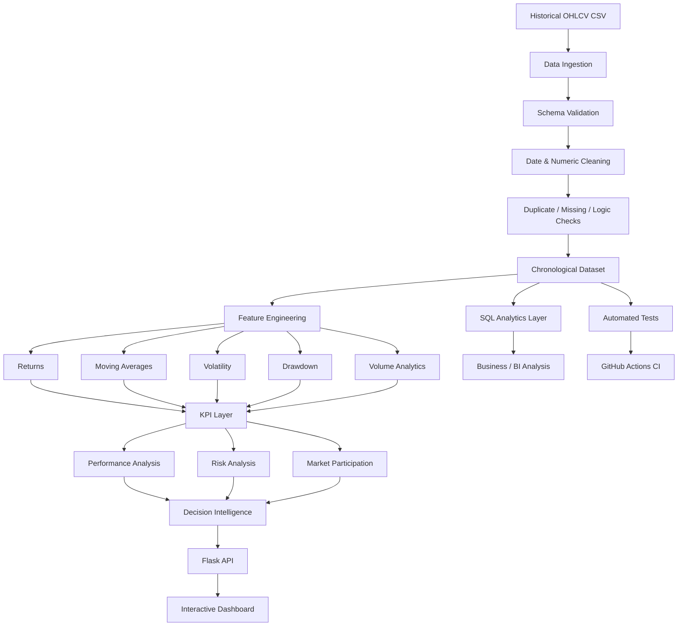

# Financial Market Analytics & Decision Intelligence Dashboard

> **Portfolio focus:** Data Analytics • BI Analytics • Financial Data Analysis • Decision Intelligence

An end-to-end financial analytics and business intelligence project that transforms historical OHLCV market data into **validated datasets, analytical KPIs, performance and risk measures, market-behaviour signals, SQL analysis, and decision-oriented dashboard insights**.

The project is intentionally designed as an **analyst/BI portfolio solution** rather than a simple stock-chart application. It demonstrates the complete path from raw data to stakeholder-facing insight:

**Raw Data → Data Quality → Transformation → KPI Engineering → Performance & Risk Analysis → Visualization → Insight → Decision Support**

---

## 1. Project Overview

Financial market data contains useful information about price movement and trading activity, but raw OHLCV records do not directly answer business questions.

This project builds an analytical layer on top of historical market data to help an analyst investigate:

- overall asset performance;
- short-, medium- and year-to-date returns;
- trend direction using moving averages;
- volatility and downside risk;
- historical drawdowns and recovery behaviour;
- trading-volume participation and unusual activity;
- positive versus negative market sessions;
- data quality and reliability;
- analyst observations that require further investigation.

The dashboard is **descriptive and decision-support oriented**. It does not provide investment recommendations or claim to predict future market prices.

---

## 2. Business Objective

### Primary objective

Convert a historical market dataset into a **reliable analytical product** that a Data Analyst, BI Analyst, portfolio researcher, or business stakeholder could use to understand market behaviour quickly.

### Analytical objectives

| Objective | Business Question | Output |
|---|---|---|
| Performance | How has the asset performed? | Daily, 5D, 20D, YTD and period returns |
| Trend | Is price behaviour changing? | Moving averages and price-vs-MA analysis |
| Risk | How unstable has the asset been? | Annualized and rolling volatility |
| Downside | How severe were historical losses? | Current and maximum drawdown |
| Efficiency | How does return compare with risk? | Sharpe, Sortino and Calmar-style measures |
| Participation | Is trading activity elevated? | Volume ratio and rolling average volume |
| Market behaviour | How frequently did price rise/fall? | Up/down session analysis |
| Data reliability | Can the dataset be trusted? | Quality checks and validation metrics |
| Decision support | What deserves analyst attention? | Automated descriptive insights |

---

## 3. End-to-End Analytical Flow



### What this flow demonstrates

1. **Ingestion** — reads the historical OHLCV dataset.
2. **Validation** — checks schema, dates, numeric values, duplicates and OHLC relationships.
3. **Transformation** — creates reusable analytical fields rather than hardcoding dashboard values.
4. **KPI engineering** — calculates performance, risk, volume and efficiency measures.
5. **Analysis** — separates performance, risk and participation questions.
6. **Decision intelligence** — converts metrics into concise analyst observations.
7. **Delivery** — exposes the analytical layer through Flask APIs and a responsive dashboard.
8. **SQL parity** — provides database-oriented versions of core analytical questions.
9. **Quality assurance** — validates the analytical contract through Pytest and CI.

---

## 4. Analytical Architecture

```text
                         ┌─────────────────────────┐
                         │   Historical OHLCV CSV   │
                         └────────────┬────────────┘
                                      │
                                      ▼
                         ┌─────────────────────────┐
                         │   Data Validation Layer  │
                         │ schema • types • dates  │
                         │ nulls • duplicates • QC │
                         └────────────┬────────────┘
                                      │
                                      ▼
                         ┌─────────────────────────┐
                         │  Analytical Data Layer  │
                         │ returns • MA • volatility│
                         │ drawdown • volume ratios │
                         └────────────┬────────────┘
                                      │
                    ┌─────────────────┼─────────────────┐
                    ▼                 ▼                 ▼
          ┌─────────────────┐ ┌─────────────────┐ ┌─────────────────┐
          │ Python KPI Layer│ │  SQL Analytics  │ │ Test / CI Layer │
          └────────┬────────┘ └────────┬────────┘ └─────────────────┘
                   │                   │
                   └─────────┬─────────┘
                             ▼
                    ┌──────────────────┐
                    │ Decision Support │
                    │ insights + flags │
                    └────────┬─────────┘
                             ▼
                    ┌──────────────────┐
                    │ Flask REST API   │
                    └────────┬─────────┘
                             ▼
                    ┌──────────────────┐
                    │ BI Dashboard     │
                    │ KPIs • charts •  │
                    │ insights         │
                    └──────────────────┘
```

This separation keeps **data preparation, analytical logic, delivery and presentation concerns distinct**, making the project easier to test, explain and extend.

---

## 5. Core Analytical Functions

The analytical engine in `app.py` is organized around reusable functions rather than dashboard-specific calculations.

| Function / Layer | Responsibility |
|---|---|
| `load_data()` | Reads, validates, cleans, chronologically sorts the source dataset, and creates the reusable derived analytical fields |
| `_safe_ratio()` | Safely calculates ratio-based KPIs while handling zero or missing denominators |
| `build_metrics()` | Produces the dashboard KPI dictionary from the prepared analytical dataset |
| `build_insights()` | Converts KPI relationships into descriptive analyst observations |
| `chart_payload()` | Prepares recent analytical series for the dashboard charts |
| `/api/data` | Serves recent observations and derived analytical fields to the frontend |
| `/api/metrics` | Serves the KPI layer as JSON |
| `/api/health` | Provides lightweight application/data health information |

### Analytical calculation flow

```text
load_data()
    │
    ├── Validate required columns
    ├── Parse dates
    ├── Coerce numeric values
    ├── Remove invalid / duplicate observations
    ├── Validate OHLC relationships
    ├── Sort chronologically
    └── Create derived analytics
            │
            ├── Daily Return / Return %
            ├── Cumulative Return
            ├── MA20 / MA50 / MA200
            ├── Rolling Volatility
            ├── Rolling Average Volume
            ├── Volume Ratio
            ├── Drawdown
            ├── Volume Change
            └── Range %
            │
            ▼
build_metrics()
    │
    ├── Performance
    ├── Risk
    ├── Efficiency
    ├── Participation
    └── Data Quality
            │
            ▼
build_insights()
    │
    └── Analyst-facing observations
```

---

## 6. KPI Framework

### Performance

- Latest close
- Daily return
- 5-day return
- 20-day return
- Year-to-date return
- Full-period cumulative return
- CAGR

### Risk

- Annualized volatility
- Rolling 20D annualized volatility
- Downside volatility
- Maximum drawdown
- Current drawdown

### Risk-adjusted performance

- Sharpe ratio
- Sortino ratio
- Calmar ratio
- Profit factor

### Market participation

- Average volume
- 20D average volume
- Volume ratio
- Volume change
- Up/down session counts

### Data quality

- Missing-value count
- Duplicate-date count
- Chronological-order validation
- OHLC consistency checks

See [`docs/kpi_dictionary.md`](docs/kpi_dictionary.md) for the metric definitions, formulas, interpretation guidance and dashboard mapping.

---

## 7. Dashboard Storytelling

The dashboard is structured to follow an analyst's decision path:

```text
Executive Snapshot
       ↓
Performance & Trend
       ↓
Market Participation
       ↓
Risk & Drawdown
       ↓
Data Quality
       ↓
Analyst Insights
       ↓
Methodology / Interpretation Boundary
```

This is intentionally different from a chart-only stock application: every visual is connected to an analytical question and accompanied by an interpretation boundary.

---

## 8. SQL Analytics Layer

The `sql/` directory provides PostgreSQL-style analytical examples covering:

- data-quality auditing;
- daily and multi-period performance;
- moving averages and volume baselines;
- rolling volatility and drawdown;
- strongest/weakest observations;
- risk bands and review queues;
- KPI-oriented summary queries.

The SQL layer demonstrates how the same business questions can be implemented in a relational analytics environment and later connected to a warehouse/BI workflow.

See [`sql/README.md`](sql/README.md) for the query catalogue and SQL-to-dashboard mapping.

---

## 9. Data Quality & Validation

Before analytical outputs are exposed, the application validates:

- required OHLCV columns;
- parseable dates and numeric fields;
- duplicate dates;
- chronological ordering;
- negative values and zero close prices;
- logical OHLC relationships (`High >= Open/Close` and `Low <= Open/Close`);
- minimum observations required for rolling analytics.

Automated tests cover the data contract, KPI outputs, metric consistency, API fields and health metadata.

---

## 10. Technology Stack

| Layer | Technology |
|---|---|
| Language | Python |
| Data analysis | pandas, NumPy |
| Backend | Flask |
| Visualization | Chart.js |
| SQL analytics | PostgreSQL-style SQL |
| Testing | Pytest |
| CI | GitHub Actions |
| Documentation | Markdown + Mermaid/ASCII analytical diagrams |
| Version control | Git / GitHub |

---

## 11. Project Structure

```text
Financial-Market-Analytics-And-Decision-Intelligence-Dashboard/
├── app.py
├── data/
│   └── stock_data.csv
├── docs/
│   ├── analytics_methodology.md
│   ├── business_questions.md
│   ├── data_dictionary.md
│   ├── kpi_dictionary.md
│   └── methodology.md
├── sql/
│   ├── README.md
│   ├── data_quality.sql
│   ├── kpi_analysis.sql
│   ├── performance_analysis.sql
│   ├── ranking_analysis.sql
│   └── risk_analysis.sql
├── templates/
│   └── index.html
├── static/
│   └── style.css
├── tests/
│   └── test_app.py
├── notebook/
│   └── analysis_and_prediction.ipynb
├── requirements.txt
└── .github/
    └── workflows/
        └── ci.yml
```

---

## 12. Reproducible Workflow

```bash
git clone https://github.com/siddhikalolage/Financial-Market-Analytics-And-Decision-Intelligence-Dashboard.git
cd Financial-Market-Analytics-And-Decision-Intelligence-Dashboard
pip install -r requirements.txt
python app.py
```

Run the automated tests with:

```bash
pytest -q
```

The dashboard is then available through the Flask development server configured by `app.py`.

---

## 13. Analytical Methodology

### Returns

Daily return:

`Daily Return = (Close_t / Close_(t-1)) - 1`

Period return:

`Period Return = (Close_t / Close_(t-n)) - 1`

### Moving average

`MA_n = mean(Close over previous n observations)`

### Annualized volatility

`Annualized Volatility = StdDev(Daily Returns) × √252`

### Drawdown

`Drawdown_t = (Close_t / Running Peak_t) - 1`

### Volume ratio

`Volume Ratio_t = Volume_t / Rolling 20D Average Volume_t`

### CAGR

`CAGR = (Ending Value / Beginning Value)^(1 / Years) - 1`

For interpretation details and assumptions, see [`docs/analytics_methodology.md`](docs/analytics_methodology.md).

---

## 14. Data Analyst / BI Analyst Skill Mapping

| Portfolio capability | Demonstrated evidence |
|---|---|
| Data cleaning | Schema, type, duplicate and chronology validation |
| Exploratory analytics | Returns, trend, volume, volatility and drawdown |
| KPI development | Reusable performance, risk, efficiency and quality KPIs |
| SQL | Window functions, aggregations, ranking and quality checks |
| Dashboarding | Executive KPI cards, interactive charts and analyst insights |
| Business thinking | Business questions mapped to analytical outputs |
| Data storytelling | Executive → trend → risk → participation → insight flow |
| Data quality | Explicit validation rules and quality indicators |
| API integration | Flask JSON endpoints feeding the dashboard |
| Testing | Pytest analytical-contract coverage |
| CI/CD awareness | GitHub Actions workflow |
| Documentation | KPI dictionary, methodology, SQL catalogue and architecture diagrams |

---

## 15. What Makes This More Than a Stock Dashboard?

A basic stock dashboard typically answers **“what happened to the price?”**

This project additionally addresses:

- **Can the data be trusted?** → validation and quality checks
- **How strong was the performance?** → multi-period return KPIs
- **What was the risk?** → volatility and drawdown analysis
- **Was market participation unusual?** → volume ratio
- **How efficient was historical return relative to risk?** → Sharpe / Sortino / Calmar context
- **What should an analyst investigate next?** → rule-based descriptive observations
- **Can the same logic work in SQL?** → dedicated SQL analytical layer
- **Can another analyst reproduce and validate it?** → tests, documentation and CI

The project therefore demonstrates an **analytics workflow and BI mindset**, not only frontend visualization.

---

## 16. Limitations & Interpretation Boundary

- Historical market analytics do not guarantee future performance.
- Moving averages and volume ratios are descriptive indicators, not trading instructions.
- Risk-adjusted ratios depend on the selected historical period and assumptions.
- The current risk-free-rate assumption for Sharpe/Sortino context is zero.
- SQL files are PostgreSQL-style examples and may require syntax adaptation for other database engines.
- The dashboard is a portfolio analytics product, not a production trading system or financial-advice engine.

---

## 17. Roadmap

Potential future extensions include:

- multi-asset comparison;
- sector and benchmark attribution;
- parameterized date-range analysis;
- warehouse-backed SQL/BI deployment;
- scheduled data refresh;
- role-based dashboard views;
- alerting for data-quality failures or unusual observations;
- Power BI semantic-model integration.

These are extensions to the analytics/BI layer rather than requirements for the current portfolio baseline.

---

## 18. Individual Ownership

This repository is developed as an individual portfolio project demonstrating end-to-end ownership across data preparation, analytics engineering, SQL analysis, dashboard development, testing, documentation, and delivery.
