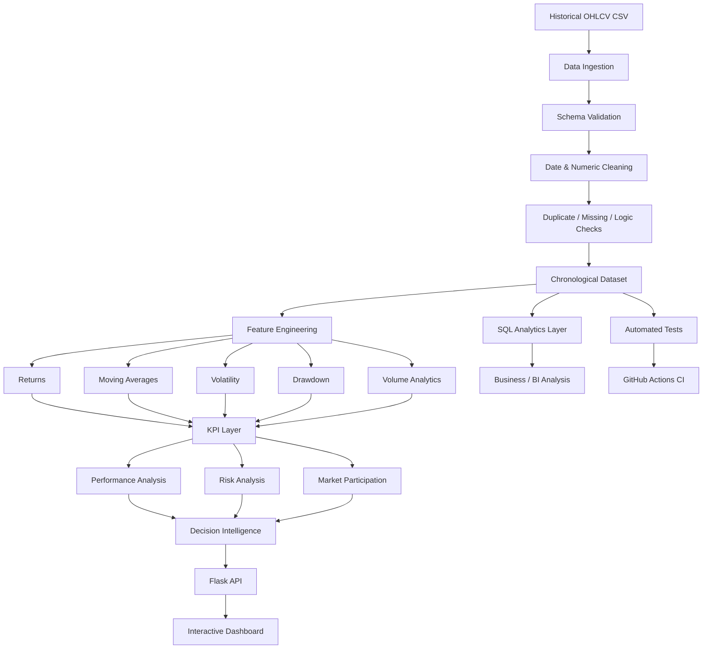

# Financial Market Analytics & Decision Intelligence Dashboard

> **Portfolio focus:** Data Analytics • BI Analytics • Financial Data Analysis • Decision Intelligence

An end-to-end financial analytics and business intelligence project that transforms historical OHLCV market data into **validated datasets, analytical KPIs, performance and risk measures, market-behaviour signals, SQL analysis, and decision-oriented dashboard insights**.

The project is intentionally designed as an **analyst/BI portfolio solution** rather than a simple stock-chart application. It demonstrates the complete path from raw data to stakeholder-facing insight:

**Raw Data → Data Quality → Transformation → KPI Engineering → Performance & Risk Analysis → Visualization → Insight → Decision Support**

---

## 1. Project Overview

Financial market data contains useful information about price movement and trading activity, but raw OHLCV records do not directly answer business questions.

This project builds an analytical layer on top of historical market data to help an analyst investigate:

- overall asset performance;
- short-, medium- and year-to-date returns;
- trend direction using moving averages;
- volatility and downside risk;
- historical drawdowns and recovery behaviour;
- trading-volume participation and unusual activity;
- positive versus negative market sessions;
- data quality and reliability;
- analyst observations that require further investigation.

The dashboard is **descriptive and decision-support oriented**. It does not provide investment recommendations or claim to predict future market prices.

---

## 2. Business Objective

### Primary objective

Convert a historical market dataset into a **reliable analytical product** that a Data Analyst, BI Analyst, portfolio researcher, or business stakeholder could use to understand market behaviour quickly.

### Analytical objectives

| Objective | Business Question | Output |
|---|---|---|
| Performance | How has the asset performed? | Daily, 5D, 20D, YTD and period returns |
| Trend | Is price behaviour changing? | Moving averages and price-vs-MA analysis |
| Risk | How unstable has the asset been? | Annualized and rolling volatility |
| Downside | How severe were historical losses? | Current and maximum drawdown |
| Efficiency | How does return compare with risk? | Sharpe, Sortino and Calmar-style measures |
| Participation | Is trading activity elevated? | Volume ratio and rolling average volume |
| Market behaviour | How frequently did price rise/fall? | Up/down session analysis |
| Data reliability | Can the dataset be trusted? | Quality checks and validation metrics |
| Decision support | What deserves analyst attention? | Automated descriptive insights |

---

## 3. End-to-End Analytical Flow



### What this flow demonstrates

1. **Ingestion** — reads the historical OHLCV dataset.
2. **Validation** — checks schema, dates, numeric values, duplicates and OHLC relationships.
3. **Transformation** — creates reusable analytical fields rather than hardcoding dashboard values.
4. **KPI engineering** — calculates performance, risk, volume and efficiency measures.
5. **Analysis** — separates performance, risk and participation questions.
6. **Decision intelligence** — converts metrics into concise analyst observations.
7. **Delivery** — exposes the analytical layer through Flask APIs and a responsive dashboard.
8. **SQL parity** — provides database-oriented versions of core analytical questions.
9. **Quality assurance** — validates the analytical contract through Pytest and CI.

---

## 4. Analytical Architecture

```text
                         ┌─────────────────────────┐
                         │   Historical OHLCV CSV   │
                         └────────────┬────────────┘
                                      │
                                      ▼
                         ┌─────────────────────────┐
                         │   Data Validation Layer  │
                         │ schema • types • dates  │
                         │ nulls • duplicates • QC │
                         └────────────┬────────────┘
                                      │
                                      ▼
                         ┌─────────────────────────┐
                         │  Analytical Data Layer  │
                         │ returns • MA • volatility│
                         │ drawdown • volume ratios │
                         └────────────┬────────────┘
                                      │
                    ┌─────────────────┼─────────────────┐
                    ▼                 ▼                 ▼
          ┌─────────────────┐ ┌─────────────────┐ ┌─────────────────┐
          │ Python KPI Layer│ │  SQL Analytics  │ │ Test / CI Layer │
          └────────┬────────┘ └────────┬────────┘ └─────────────────┘
                   │                   │
                   └─────────┬─────────┘
                             ▼
                    ┌──────────────────┐
                    │ Decision Support │
                    │ insights + flags │
                    └────────┬─────────┘
                             ▼
                    ┌──────────────────┐
                    │ Flask REST API   │
                    └────────┬─────────┘
                             ▼
                    ┌──────────────────┐
                    │ BI Dashboard     │
                    │ KPIs • charts •  │
                    │ insights         │
                    └──────────────────┘
```

This separation keeps **data preparation, analytical logic, delivery and presentation concerns distinct**, making the project easier to test, explain and extend.

---

## 5. Core Analytical Functions

The analytical engine in `app.py` is organized around reusable functions rather than dashboard-specific calculations.

| Function / Layer | Responsibility |
|---|---|
| `load_data()` | Reads, validates, cleans and chronologically prepares the source dataset |
| `add_derived_metrics()` | Creates returns, moving averages, volatility, drawdown and volume features |
| `build_metrics()` | Produces the dashboard KPI dictionary |
| `build_insights()` | Converts KPI relationships into descriptive analyst observations |
| `/api/data` | Serves recent analytical observations to the frontend |
| `/api/metrics` | Serves the KPI layer |
| `/api/health` | Provides lightweight application/data health information |

### Analytical calculation flow

```text
load_data()
    │
    ├── Validate required columns
    ├── Parse dates
    ├── Coerce numeric values
    ├── Remove invalid / duplicate observations
    ├── Validate OHLC relationships
    └── Sort chronologically
            │
            ▼
add_derived_metrics()
    │
    ├── Daily Return / Return %
    ├── Cumulative Return
    ├── MA20 / MA50 / MA200
    ├── Rolling Volatility
    ├── Rolling Average Volume
    ├── Volume Ratio
    ├── Drawdown
    ├── Volume Change
    └── Range %
            │
            ▼
build_metrics()
    │
    ├── Performance
    ├── Risk
    ├── Efficiency
    ├── Participation
    └── Data Quality
            │
            ▼
build_insights()
    │
    └── Analyst-facing observations
```

---

## 6. KPI Framework

### Performance

- Latest close
- Daily return
- 5-day return
- 20-day return
- Year-to-date return
- Full-period cumulative return
- CAGR

### Risk

- Annualized volatility
- Downside volatility
- Rolling 20-day volatility
- Maximum drawdown
- Current drawdown

### Risk-adjusted / efficiency indicators

- Sharpe-style ratio
- Sortino-style ratio
- Calmar-style ratio
- Profit factor

These metrics are intended for **descriptive historical analysis**, not portfolio optimization or investment advice.

### Participation and market behaviour

- Average volume
- Latest volume ratio versus 20-day average
- Volume change
- Up-day count
- Down-day count
- Price range percentage
- Price position relative to moving averages

### Data quality

The application also exposes analytical-quality indicators such as:

- missing-value count;
- duplicate-date count;
- chronological ordering status;
- observation count;
- dataset start and end dates.

---

## 7. Dashboard Storytelling

The dashboard is structured as an analyst workflow rather than a collection of unrelated charts.

### 1. Executive Snapshot

Answers: **“What is happening?”**

Displays high-level performance and risk indicators so a stakeholder can understand the current state quickly.

### 2. Performance & Trend

Answers: **“How has price behaved?”**

Compares price with moving averages and highlights short- and medium-term return behaviour.

### 3. Market Participation

Answers: **“Is trading activity changing?”**

Uses volume and rolling-average comparisons to identify periods of unusually high or low participation.

### 4. Risk & Downside

Answers: **“How unstable or vulnerable has the asset been?”**

Shows rolling volatility and drawdown behaviour to provide context for observed returns.

### 5. Decision Intelligence

Answers: **“What should an analyst investigate next?”**

Transforms relationships between KPIs into concise descriptive observations, such as price distance from a moving average, elevated volume, volatility conditions or drawdown status.

### 6. Methodology

Answers: **“How was each number calculated?”**

Makes the dashboard auditable by documenting definitions, assumptions and interpretation boundaries.

---

## 8. Data Quality & Validation

Data quality is treated as part of the analytical workflow, not as an afterthought.

Before analytics are generated, the application checks:

- required OHLCV columns exist;
- dates can be parsed;
- numeric fields can be converted safely;
- observations are chronologically ordered;
- duplicate dates are identified;
- missing values are handled;
- OHLC values are logically consistent;
- negative OHLCV values are rejected;
- zero closing prices are rejected;
- sufficient observations exist for rolling calculations.

For example:

```text
High >= max(Open, Close)
Low  <= min(Open, Close)
Close > 0
Volume >= 0
```

This prevents invalid source records from silently producing misleading KPIs.

---

## 9. SQL Analytics Layer

The `sql/` directory demonstrates how the same business questions can be expressed in a relational analytics environment.

| SQL file | Analytical purpose |
|---|---|
| `data_quality.sql` | Nulls, duplicates, date coverage and OHLC consistency |
| `kpi_analysis.sql` | Current KPIs and drawdown calculations |
| `performance_analysis.sql` | Returns and moving-average analysis |
| `risk_analysis.sql` | Rolling volatility and drawdown analysis |
| `ranking_analysis.sql` | Descriptive performance/risk ranking |

The SQL layer is intentionally aligned with the Python analytical model so the project demonstrates **transferable analytics thinking**, not just Python-specific implementation.

---

## 10. API Layer

The Flask application exposes a lightweight analytical API:

| Endpoint | Purpose |
|---|---|
| `GET /` | Renders the interactive dashboard |
| `GET /api/data` | Returns recent observations and derived analytical fields |
| `GET /api/metrics` | Returns the analytical KPI layer |
| `GET /api/health` | Returns application and dataset health information |

The frontend consumes the API rather than embedding calculated values directly into the HTML.

---

## 11. Technology Stack

### Data & Analytics

- **Python**
- **Pandas**
- **NumPy**
- **Scikit-learn** for the secondary notebook benchmark

### BI / Visualization

- **Chart.js**
- **HTML5 / CSS3**
- Responsive dashboard design

### Application

- **Flask**
- JSON API endpoints

### Database / Analytics

- **SQL**
- Window-function based analytical patterns

### Development & Quality

- **Jupyter Notebook**
- **Pytest**
- **GitHub Actions**
- Git / GitHub version control

---

## 12. Project Structure

```text
Financial-Market-Analytics-And-Decision-Intelligence-Dashboard/
│
├── data/
│   └── stock_data.csv                  # Historical OHLCV dataset
│
├── docs/
│   ├── business_questions.md            # Stakeholder questions → metrics → views
│   ├── data_dictionary.md               # Source and derived fields
│   └── methodology.md                   # Calculation and interpretation contract
│
├── notebook/
│   └── analysis_and_prediction.ipynb    # Exploratory / secondary modelling work
│
├── sql/
│   ├── data_quality.sql                 # Data validation analysis
│   ├── kpi_analysis.sql                 # KPI calculations
│   ├── performance_analysis.sql         # Returns and trend analysis
│   ├── risk_analysis.sql                # Volatility and drawdown analysis
│   └── ranking_analysis.sql             # Ranking / descriptive segmentation
│
├── tests/
│   └── test_app.py                      # Automated analytical/API tests
│
├── .github/
│   └── workflows/
│       └── ci.yml                       # Continuous integration
│
├── static/
│   └── style.css                        # Responsive dashboard styling
│
├── templates/
│   └── index.html                       # Dashboard presentation layer
│
├── app.py                               # Data + analytics + API engine
├── requirements.txt                     # Python dependencies
└── Readme.md                            # Project documentation
```

---

## 13. Reproducible Analytical Workflow

```text
1. Clone repository
       ↓
2. Create isolated Python environment
       ↓
3. Install dependencies
       ↓
4. Validate dataset through application logic
       ↓
5. Run automated tests
       ↓
6. Start Flask dashboard
       ↓
7. Review KPIs and analytical charts
       ↓
8. Investigate generated observations
       ↓
9. Review SQL equivalents for BI/database analysis
```

This workflow makes the project easier for another analyst or recruiter to inspect and reproduce.

---

## 14. Running Locally

```bash
git clone https://github.com/siddhikalolage/Financial-Market-Analytics-And-Decision-Intelligence-Dashboard.git
cd Financial-Market-Analytics-And-Decision-Intelligence-Dashboard
python -m venv .venv
```

### Windows PowerShell

```powershell
.\.venv\Scripts\Activate.ps1
pip install -r requirements.txt
python -m pytest -q
python app.py
```

Then open:

```text
http://127.0.0.1:5000/
```

For development debugging, set `FLASK_DEBUG=1`. The application defaults to debug-disabled behaviour.

---

## 15. Methodology

### Daily Return

```text
(Current Close / Previous Close - 1) × 100
```

### Cumulative Return

```text
(Current Close / First Close - 1) × 100
```

### Annualized Volatility

The standard deviation of daily percentage returns is scaled by `√252`, using 252 as a common approximation for annual trading sessions.

### Maximum Drawdown

```text
(Current Close / Running Peak - 1) × 100
```

### Moving Average

Rolling moving averages provide descriptive trend context. The dashboard calculates 20-, 50- and 200-observation moving averages in the analytical layer.

### Volume Ratio

```text
Latest Volume / Rolling Average Volume
```

A ratio above 1 indicates that the latest trading volume is above its rolling baseline; it should be interpreted as a descriptive participation signal rather than a trading recommendation.

For the complete analytical contract, see `docs/methodology.md`.

---

## 16. Predictive Modelling Note

The notebook retains a small predictive benchmark as a **secondary learning component**. Its chronological split occurs before feature scaling to prevent test-period information from influencing the scaler.

The production dashboard deliberately prioritizes:

- transparent historical analytics;
- explainable KPIs;
- risk and performance context;
- reproducible calculations;
- decision-oriented visualization.

Any future forecasting extension should use chronological validation, leakage prevention, appropriate baselines and clearly reported error metrics before being considered a production-quality forecasting component.

---

## 17. Testing & Quality Assurance

The repository includes automated tests covering:

- dataset schema;
- date ordering and uniqueness;
- OHLCV validity;
- derived analytical fields;
- KPI availability;
- KPI consistency with the source dataframe;
- data-quality metrics;
- API health response;
- analytical data endpoint.

GitHub Actions is configured to execute the test suite for the relevant branches.

The objective is to make analytical changes **testable and reproducible**, not just visually correct.

---

## 18. Data Analyst / BI Analyst Skill Mapping

| Skill | Evidence in Project |
|---|---|
| Python | Data ingestion, transformation, KPI calculations and API layer |
| Pandas / NumPy | Time-series preparation and analytical feature engineering |
| SQL | Data quality, KPI, performance, risk and ranking queries |
| Data Cleaning | Type coercion, missing values, duplicates and validation rules |
| EDA | Returns, trends, volatility, drawdowns and volume behaviour |
| KPI Development | Performance, risk, efficiency and participation metrics |
| BI Dashboarding | Interactive KPI cards, charts, insights and methodology |
| Data Storytelling | Business-question-driven dashboard structure |
| Statistical Analysis | Volatility, downside measures and risk-adjusted indicators |
| API Development | Flask JSON endpoints for analytical delivery |
| Testing | Pytest analytical and API contract tests |
| CI/CD | GitHub Actions validation workflow |
| Documentation | Data dictionary, methodology, business questions and architecture |
| Decision Intelligence | KPI relationships converted into analyst-facing observations |

---

## 19. What Makes This More Than a Stock Dashboard?

A basic stock dashboard typically stops at:

```text
CSV → Chart
```

This project extends that workflow to:

```text
CSV
 ↓
Validation
 ↓
Cleaning
 ↓
Reusable analytical transformations
 ↓
Financial KPI framework
 ↓
Performance + risk + participation analysis
 ↓
SQL equivalents
 ↓
Automated testing
 ↓
API delivery
 ↓
Interactive BI dashboard
 ↓
Decision-oriented insights
```

The emphasis is therefore on **analytical reasoning and business interpretation**, not simply visualization.

---

## 20. Future Enhancement Roadmap

Potential extensions include:

- multi-asset comparison;
- sector and benchmark comparison;
- configurable date ranges;
- downloadable analytical datasets;
- richer anomaly investigation views;
- database-backed ingestion;
- scheduled data refresh;
- role-oriented dashboard views;
- additional BI reporting layers.

These are intentionally separated from the current scope so the existing analytical pipeline remains understandable and reproducible.

---

## 21. Ownership

This repository is maintained as an **individual portfolio project by Siddhika Lolage**.

The implementation demonstrates end-to-end ownership across data preparation, analytical modelling, SQL analysis, dashboard development, testing, documentation and decision-support presentation.

---

## 22. Disclaimer

This project is for educational and portfolio demonstration purposes. Historical analytics do not guarantee future market performance and should not be interpreted as financial, investment or trading advice.
